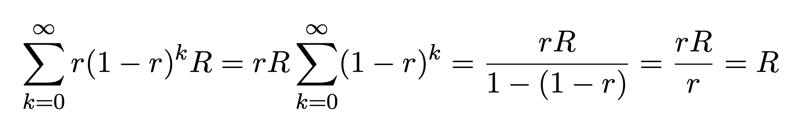

<!--
order: 1
-->

# Concepts

## Inflation

In a Proof of Stake (PoS) blockchain, inflation is used as a tool to incentivize
participation in the network. Inflation creates and distributes new tokens to
participants who can use their tokens to either interact with the protocol or
stake their assets to earn rewards and vote for governance proposals.

Especially in an early stage of a network, where staking rewards are high and
there are fewer possibilities to interact with the network, inflation can be
used as the major tool to incentivize staking and thereby securing the network.

With more stakers, the network becomes increasingly stable and decentralized. It
becomes *stable*, because assets are locked up instead of causing price changes
through trading. And it becomes *decentralized,* because the power to vote for
governance proposals is distributed amongst more people.

## Astra Token Model

The Astra Token Model outlines how the Astra network is secured through a
balanced incentivized interest from users, developers and validators. In this
model, inflation plays a major role in sustaining this balance. With an initial
supply of 8,888,780,000 Astras and 111,111,000 Astras being issued through inflation
during the first year, the model suggests an exponential decline in inflation to
the rest of Astras in subsequent years.

Here are the detail of the tokenomics:

|                              |    % |           #ASA | Minted at genesis |                                                                Vesting schedule |
|:-----------------------------|-----:|---------------:|------------------:|--------------------------------------------------------------------------------:|
| **Core Contributors**        |  15% |  1,666,650,000 |     1,666,650,000 | 100% minted at genesis: 20% unlocked at genesis, 80% linearly vested in 8 years |
| **Genesis Partners**         |  15% |  1,666,650,000 |     1,666,650,000 | 100% minted at genesis: 20% unlocked at genesis, 80% linearly vested in 8 years |
| **Dev/Community Incentives** |   5% |    555,550,000 |       555,550,000 | 100% minted at genesis: 20% unlocked at genesis, 80% linearly vested in 8 years |
| **Staking Rewards**          |  20% |  2,222,200,000 |                 0 |                              100% exponentially vested with `decay_factor = 5%` |
| **Reward Providers**         |  30% |  3,333,300,000 |     3,333,300,000 |                        100% minted & locked at genesis, unlocked with GOV rules |
| **Reserve Treasury**         |  10% |  1,111,100,000 |     1,111,100,000 |                        100% minted & locked at genesis, unlocked with GOV rules |
| **LP Rewards**               |   5% |    555,550,000 |       555,550,000 |                        100% minted & locked at genesis, unlocked with GOV rules |
| **Total**                    | 100% | 11,111,000,000 |     8,888,780,000 |                                                                                 |


### Exponential Inflation - Block Rewards
There will be a total of 20% of the total supply that will be distributed as block rewards which are mainly 
distributed as Staking Rewards. This module is dedicated to this allocation.

Block rewards are minted in `daily` epochs, via a decay function. During a period of 365 epochs (i.e, one year), a
daily provision of Astra tokens is minted and allocated to staking rewards and reserve treasury. Within a period,
the epoch provision does not change. The epoch provision is then reduced by a factor of `(1-r)` for subsequent years, 
with a decay factor `r`. Precisely, at the end of each period, the provision is recalculated as follows:
```latex
f(x) = r * (1 - r)^x * R
where
    x = variable = period (i.e, year)
    r = 0.1 = decay factor
    R = total amount of block rewards
```

With the given formula of `f(x)`, we can make sure that the total of minted block rewards never exceeds `R`, as:


With a decay factor of `0.05`, there will be a total of 40%, 64%, 87% and 98% of block rewards minted after the first 10, 
20, 40, and 80 years,
respectively. As a result, most of the block rewards will be distributed after 80 years. The decay factor can be changed via 
governance voting. A higher decay factor means it takes less time to mint most of the block rewards while a lower
decay factor results in a longer minting period.