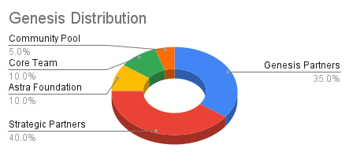
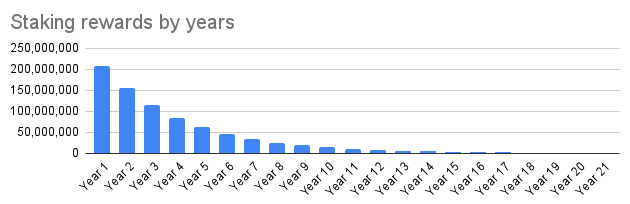
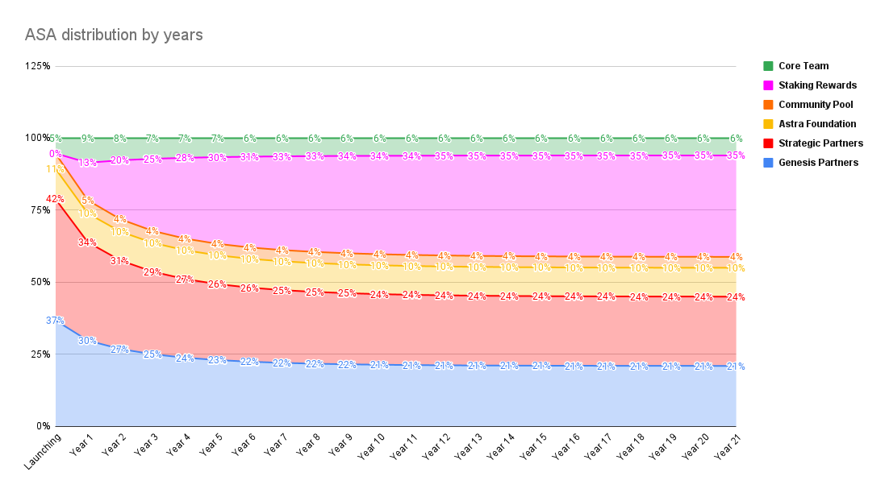

<!--
order: 1
-->

# Concepts

## Inflation

In a Proof of Stake (PoS) blockchain, inflation is used as a tool to incentivize
participation in the network. Inflation creates and distributes new tokens to
participants who can use their tokens to either interact with the protocol or
stake their assets to earn rewards and vote for governance proposals.

Especially in an early stage of a network, where staking rewards are high and
there are fewer possibilities to interact with the network, inflation can be
used as the major tool to incentivize staking and thereby securing the network.

With more stakers, the network becomes increasingly stable and decentralized. It
becomes *stable*, because assets are locked up instead of causing price changes
through trading. And it becomes *decentralized,* because the power to vote for
governance proposals is distributed amongst more people.

## Astra Token Model

The Astra Token Model outlines how the Astra network is secured through a
balanced incentivized interest from users, developers and validators. In this
model, inflation plays a major role in sustaining this balance. With an initial
supply of 1,200,000,000 ASAs and 208,000,000 ASAs being issued through inflation
during the first year, the model suggests an exponential decline in inflation to
the rest of ASAs in subsequent years.

### Genesis Distribution
At genesis launch, there is a total of 1,200,000,000 distributed to Genesis Partners, Strategic Partners (Backers), 
Astra Foundation, Core Team and the Community Pool. Here are the details:

|                        |    % |         #ASAs | Minted at genesis |                                                                                  Vesting schedule |
|:-----------------------|-----:|--------------:|------------------:|--------------------------------------------------------------------------------------------------:|
| **Genesis Partners**   |  35% |   420,000,000 |       420,000,000 |                                                               100% minted and unlocked at genesis |
| **Strategic Partners** |  40% |   480,000,000 |       480,000,000 |                                                               100% minted and unlocked at genesis |
| **Astra Foundation**   |  10% |   120,000,000 |       120,000,000 |                                                               100% minted and unlocked at genesis |
| **Core Team**          |  10% |   120,000,000 |        60,000,000 |                                                50% unlocked at genesis, 50% unlocked after 1 year |
| **Community Pool**     |   5% |    60,000,000 |        60,000,000 |                                          100% minted & locked at genesis, unlocked with GOV rules |
| **Total**              | 100% | 1,200,000,000 |     1,200,000,000 |                                                                                                   |

##


### Exponential Inflation - Block Rewards
#### Inflation Calculation
There will be a total of 40% of the total supply that will be distributed as block rewards which are mainly 
distributed as Staking Rewards. This module is dedicated to this allocation.

Block rewards are minted in `daily` epochs, via a decay function. During a period of 365 epochs (i.e, one year), a
daily provision of Astra tokens is minted and allocated to staking rewards and reserve treasury. Within a period,
the epoch provision does not change. The epoch provision is then reduced by a factor of `(1-r)` for subsequent years, 
with a decay factor `r`. Precisely, at the end of each period, the provision is recalculated as follows:
```latex
f(x) = r * (1 - r)^x * R
where
    x = variable = period (i.e, year)
    r = 0.05 = decay factor
    R = total amount of block rewards
```

With the given formula of `f(x)`, we can make sure that the total of minted block rewards never exceeds `R`, as:


With a decay factor of `0.26`, there will be a total of 78%, 95% and 99% of block rewards minted after the first 5, 
10, 15 years, respectively. As a result, most of the block rewards will be distributed after 20 years. 
The decay factor can be changed via governance voting. A higher decay factor means it takes less time to mint most of 
the block rewards while a lower decay factor results in a longer minting period.

With the setting for `decayFactor = 0.26`, we can visualize the block rewards minted over years as follows:



#### Inflation Distribution
Each epoch provision is divided and distributed to 3 entities:
- Staking Rewards: 88%
- Astra Foundation: 10%
- Community Pool: 2%

For example, if `epochProvision = 100 ASAs` then 88 ASAs are distributed validators/delegators, 10 ASAs will go to the 
Astra Foundation, and the remaining 2 ASAs are added to the Community Pool.
Following is the proportions distributed to each category by years:

